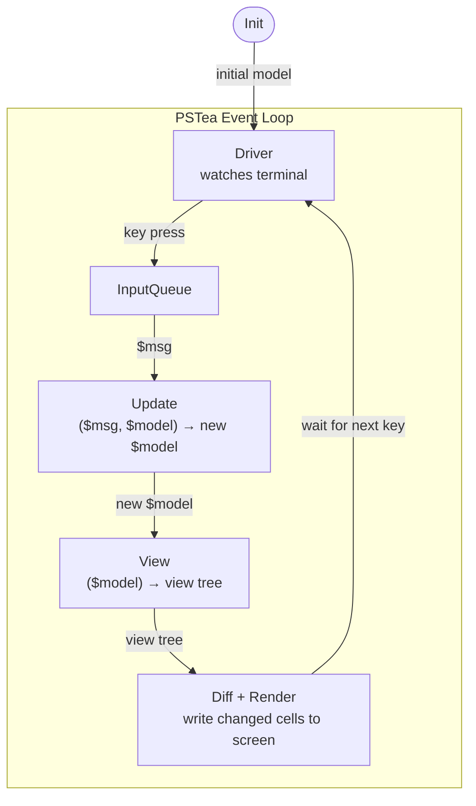

# B-01 — MVU Architecture

## Objectives

By the end of this lesson you will be able to:

- Describe what the Model-View-Update pattern is and why it exists
- Explain the role of Init, Update, and View in a PSTea program
- Draw the data-flow cycle from key press to screen update
- Identify what `$msg`, `$model`, and `Cmd` are
- Explain why Update must be pure (no side effects)

---

## Prerequisites

> **No prior TUI or framework experience required.**
> You need: basic PowerShell — variables, hashtables, scriptblocks (`{ ... }`),
> and PSCustomObjects (`[PSCustomObject]@{ ... }`).
> No PSTea-specific knowledge assumed.

---

## Concept

### The problem: mutable shared state

Traditional interactive terminal apps accumulate state in variables scattered across
functions. When a keypress fires, several things need to update — and it is easy for
them to get out of sync. Tracking down a bug means understanding which function
last touched which variable.

**MVU solves this with a single rule:** there is exactly one place where state lives
(the **model**), and it can only change in one place (the **update** function).

### The three layers

PSTea implements **The Elm Architecture (TEA)**, also known as
**Model-View-Update (MVU)**. Every PSTea program consists of exactly three scriptblocks:

---

#### Init

Called once when the program starts. Takes no parameters. Returns a `PSCustomObject` with two properties:

- `Model` — the initial state of your application. This can be any `PSCustomObject`.
- `Cmd` — an optional command. For Init, this is almost always `$null`.

```powershell
$initFn = {
    [PSCustomObject]@{
        Model = [PSCustomObject]@{ Count = 0 }
        Cmd   = $null
    }
}
```

Think of Init as answering: _"What does my app look like before the user does anything?"_

---

#### Update

Called every time something happens (a key is pressed, a timer fires, etc.).
Receives the **message** (`$msg`) and the **current model** (`$model`). Returns a
`PSCustomObject` with a new `Model` and a `Cmd`.

```powershell
$updateFn = {
    param($msg, $model)
    # examine $msg, produce a new model
    [PSCustomObject]@{
        Model = [PSCustomObject]@{ Count = $model.Count + 1 }
        Cmd   = $null
    }
}
```

**Update must be pure.** That means:
- No `Write-Host`, `Write-Output`, file writes, or network calls
- No mutations of `$model` in place
- Always returns a new `PSCustomObject` for `Model`

Update answers: _"Given what just happened, what should the state be now?"_

---

### Pure vs. side-effectful code

This distinction matters a lot in PSTea, so it's worth being explicit.

**A function is pure if:**
- given the same inputs, it always returns the same output
- it has no observable effect on the outside world

**A function has side effects if** it reads from or writes to anything outside its
own local variables: the filesystem, the network, the terminal, the clock,
randomness, or shared mutable state.

| Safe in Update | Not safe in Update |
|---|---|
| Math: `$x + 1` | `Write-Host`, `Write-Output` |
| String formatting: `"Hello, $name"` | File reads/writes: `Get-Content`, `Set-Content` |
| Conditional logic: `if/switch` | Network calls: `Invoke-RestMethod` |
| Calling pure helper functions | Reading the clock: `Get-Date` |
| Building new `PSCustomObject`s | Randomness: `Get-Random` |
| | Native commands: `git`, `curl`, etc. |

**The practical self-test:** "Could I call this twice in a row and get the same
result both times, with nothing in the world changing?" If yes, it's safe.

**Why PSTea enforces this:** Update runs synchronously on the event loop. A blocking
call (network, slow file read, a native command) freezes the entire UI — no redraws,
no keypresses handled — until it returns. A side effect like `Write-Host` will
corrupt the terminal display because PSTea owns the screen.

**Where side effects belong:** subscriptions (timers, key events) and Cmd handlers
are the designated places for anything that touches the outside world. Those run
outside the pure update cycle. Subscriptions are covered in a later lesson.

---

#### View

Called after every Update. Receives the current model (`$model`). Returns a
**view tree** — a nested structure of `New-TeaText` and `New-TeaBox` nodes that
describes what the terminal should display.

```powershell
$viewFn = {
    param($model)
    New-TeaText -Content "Count: $($model.Count)"
}
```

You can render multiple model fields:

```powershell
$viewFn = {
    param($model)
    New-TeaBox -Children @(
        New-TeaText -Content "Count : $($model.Count)"
        New-TeaText -Content "Status: $($model.Status)"
    )
}
```

Conditional rendering based on model state:

```powershell
$viewFn = {
    param($model)
    $label = if ($model.Running) { 'Running...' } else { 'Stopped.' }
    New-TeaText -Content $label
}
```

Nesting — a box wrapping multiple text nodes:

```powershell
$viewFn = {
    param($model)
    New-TeaBox -Children @(
        New-TeaText -Content "Score: $($model.Score)"
        New-TeaText -Content "Press Q to quit"
    )
}
```

**View must also be pure.** It only reads from the model — no side effects, no state.

View answers: _"Given the current state, what should the screen show?"_

---

### The data-flow cycle



**What each node is:**

- **Init** — your `$initFn`. runs exactly once at startup to produce the first `$model`. the loop never calls it again.
- **Driver** — built-in. watches the terminal for keypresses using a background runspace. you never write this.
- **InputQueue** — built-in. the driver packages each keypress as a `$msg` object and drops it here. the loop pulls one message at a time.
- **Update** — your `$updateFn`. receives `$msg` and the current `$model`, returns a new `$model` and a `Cmd`.
- **View** — your `$viewFn`. receives the new `$model`, returns a description of the screen (a "view tree" — nested nodes, not actual terminal output yet).
- **Diff + Render** — built-in. compares the new view tree against the previous one, finds only the cells that changed, and writes the minimal ANSI sequences to update those spots.

**Your code only touches two boxes: Update and View.** Everything else is PSTea's responsibility.

PSTea runs this loop continuously until Update returns a `Quit` command.

---

### What is `$msg`?

In the simplest case (the **legacy key path**, no `SubscriptionFn`), `$msg` is a
`PSCustomObject` produced by the terminal driver when a key is pressed:

```
$msg.Type      = 'KeyDown'
$msg.Key       = 'UpArrow'   # string matching .NET ConsoleKey enum name
$msg.Char      = [char]0     # the typed character (useful for text input)
$msg.Modifiers = 0           # Shift, Ctrl, Alt flags
```

Common `.Key` values: `'UpArrow'`, `'DownArrow'`, `'LeftArrow'`, `'RightArrow'`,
`'Enter'`, `'Backspace'`, `'Escape'`, `'Tab'`, `'Spacebar'`, `'Q'`, `'A'`, `'D3'`.

In Update, you typically switch on `$msg.Key`:

```powershell
$updateFn = {
    param($msg, $model)
    switch ($msg.Key) {
        'UpArrow'   { # move selection up }
        'DownArrow' { # move selection down }
        'Enter'     { # confirm current selection }
        'Escape'    { # cancel / go back }
        'Q'         { return [PSCustomObject]@{ Model = $model; Cmd = [PSCustomObject]@{ Type = 'Quit' } } }
    }
    [PSCustomObject]@{ Model = $model; Cmd = $null }
}
```

For text input, use `$msg.Char` instead of `$msg.Key` — it holds the actual typed
character:

```powershell
# accumulate typed characters into model.Input
$newInput = $model.Input + $msg.Char
[PSCustomObject]@{
    Model = [PSCustomObject]@{ Input = $newInput }
    Cmd   = $null
}
```

When subscriptions are used (timers, etc.), the message shape differs — for example,
a timer fires a `PSCustomObject` with `Type = 'Tick'`. Those are covered in a later
lesson.

---

### What is `Cmd`?

`Cmd` is a signal from your Update function **to the PSTea framework**. It flows in
the opposite direction from `$msg`:

- `$msg` flows **into** your app — the outside world tells Update what happened
- `Cmd` flows **out** of your app — Update tells the framework what to do next

**Almost always, `Cmd` should be `$null`.** That means "nothing special, just keep
running." It is not optional — every return from Update and Init must include both
`Model` and `Cmd`.

The only other value currently supported is `Quit`:

```powershell
[PSCustomObject]@{ Type = 'Quit' }
```

Returning this tells PSTea to stop the event loop, tear down the terminal driver,
restore the cursor, and return the final model. For everything else, use `$null`.

The Cmd system is designed to be extended — future versions will support commands
like "fetch this URL" or "run this background job" — but those handlers live outside
the pure update cycle so your Update function stays testable.

---

### How PSTea maps to the three layers

```powershell
Start-TeaProgram -InitFn $initFn -UpdateFn $updateFn -ViewFn $viewFn
```

That is the entire framework entry point. `Start-TeaProgram`:

1. Calls `$initFn` to get the initial model
2. Sets up the terminal driver — see below
3. Runs the event loop until a `Quit` Cmd is returned
4. Tears down the driver and returns the final model

**What "setting up the terminal driver" actually means:**

- **Alt screen** — switches the terminal into a separate display buffer. your app
  draws into this buffer, leaving your shell history untouched. when the program
  exits, the original screen is restored automatically.
- **Cursor hiding** — hides the blinking cursor during redraws to prevent flicker.
  restored on exit.
- **Raw mode** — normally the terminal buffers your keystrokes and waits for Enter
  before sending them to a program. raw mode disables that: every keypress fires
  immediately and silently, with no echo. this is what makes interactive TUIs feel
  responsive.
- **Key reader** — a background runspace that loops on `[Console]::ReadKey()` and
  pushes each keypress onto the input queue as a `$msg` object.

All of this is automatic. If your program exits normally (via a `Quit` Cmd), the
terminal is fully restored. If it crashes, run `[Console]::CursorVisible = $true`
to get your cursor back.

---

## Common Mistakes

### "I forgot to include `Cmd` in the return object"

**Wrong:**
```powershell
$updateFn = {
    param($msg, $model)
    [PSCustomObject]@{
	    Model = [PSCustomObject]@{ Count = $model.Count + 1 }
	}
    # missing Cmd!
}
```

**Right:**
```powershell
$updateFn = {
    param($msg, $model)
    [PSCustomObject]@{
        Model = [PSCustomObject]@{ Count = $model.Count + 1 }
        Cmd   = $null
    }
}
```

Both `Model` and `Cmd` must be present in every return value from Update and Init.
A missing `Cmd` causes a null-dereference deep in the event loop — the error message
won't point back to your scriptblock.

---

### "Can I call Write-Host inside Update?"

**Wrong:**
```powershell
$updateFn = {
    param($msg, $model)
    Write-Host "debug: $($msg.Key)"   # side effect in Update!
    [PSCustomObject]@{ Model = $model; Cmd = $null }
}
```

**Right:** Update must be pure. Debug output will corrupt the terminal display.
Log to a file, or add a `DebugLog` field to the model and render it in View.

---

### "Does View only run when something changes?"

**Misconception:** "View is expensive, so I should cache it."

**Reality:** View is called on every message, but PSTea diffs the resulting tree
against the previous one and only redraws cells that changed. View should be fast
(no I/O, no computation beyond formatting strings) — then the diff cost is negligible.

---

### "Why do I need to return a whole new model object?"

**Wrong:**
```powershell
$updateFn = {
    param($msg, $model)
    $model.Count++   # mutating the model in place
    [PSCustomObject]@{ Model = $model; Cmd = $null }
}
```

**Right:**
```powershell
$updateFn = {
    param($msg, $model)
    [PSCustomObject]@{
        Model = [PSCustomObject]@{ Count = $model.Count + 1 }
        Cmd   = $null
    }
}
```

PSTea deep-copies the model before passing it to Update. "Deep copy" means every
property — and every nested object inside those properties — is duplicated into a
brand new object in memory. So when Update receives `$model`, it is not the same
object that the rest of the framework holds; it is an independent clone. Mutations
to it technically only affect the clone, not the live model.

After Update returns, the event loop replaces its internal `$model` variable with
the new one:

```powershell
$model = $updateResult.Model
```

The old object now has no variable pointing to it; PowerShell's garbage collector
will reclaim it automatically. There is no history kept, no previous model stored,
no undo stack. If you need any of that, you build it yourself by including a history
list as a field in the model.

But constructing a new object is still the idiomatic pattern; it makes your intent
explicit, forces you to name every field you carry forward, and prevents bugs where
you accidentally keep stale state from a previous shape of the model.

---

## Next Lesson

**[B-02 — Hello, PSTea](02-hello-pstea.md):** write your first running PSTea program —
a static display with a working quit handler.
